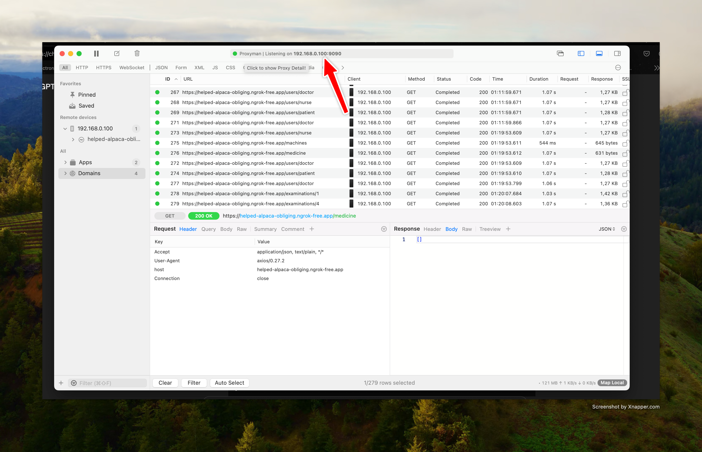

### How to run

```
npm i
```

- You need to mock api to see the UI
- Install [Proxyman](https://proxyman.io/) ->
- Start Proxyman -> Open Map Local Tool (Ctrl + Shift + L)
- Right click table -> Import settings -> Select file proxyman_map_local_tree_rules.config in this repository
- Go to `src/main/service/network-service`
- Change the host and port (your host will be different from my host, you can find your host at the top of Proxyman)
  
- Run `npm start` -> You will see the requests in Proxyman

### How to build

```
npm i
npm run build
```
